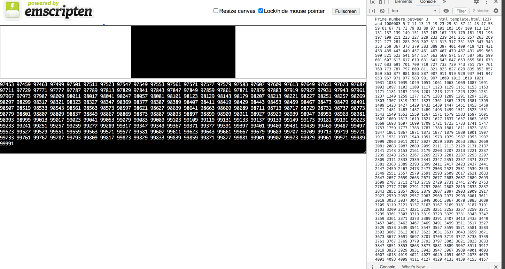
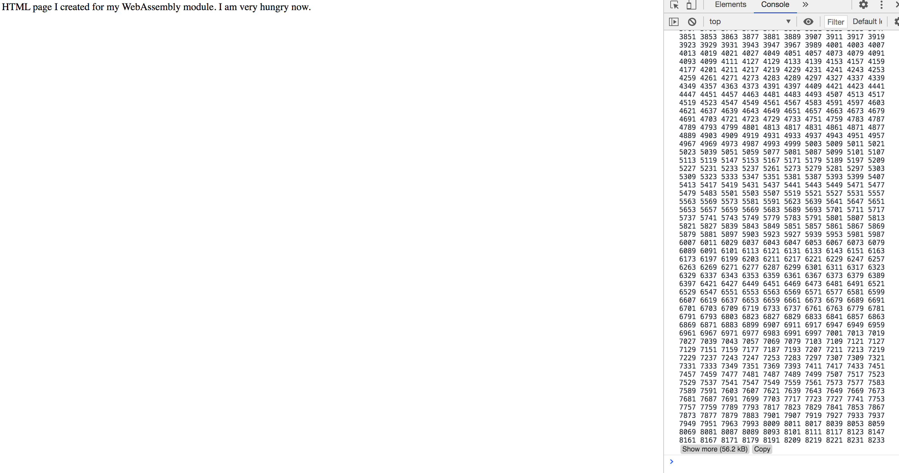
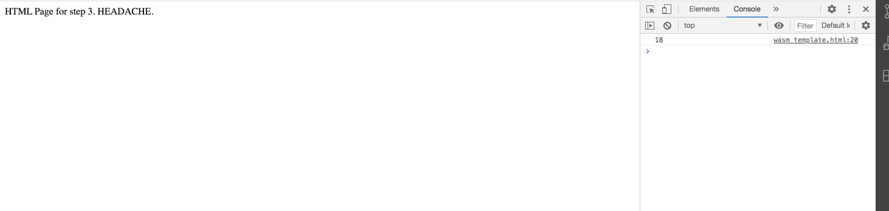

## Webassembly in Action Chapter 3
 - 출처 WebAssembly in Action 한빛 미디어, 제러드 갤런트 지음/ 이일웅 옮김

## vscode에서 c, c++ 설정법
https://csdiary.tistory.com/2
후, 진짜 귀찮았다. 

## 실행 방법1. 엠스크립튼으로 c/c++ 코드를 컴파일하고 html 템플릿 활용하기

```
python3 -m venv .env
. .env/bin/activate
python -m http.server 8080

command + shift + b -> build
command + shift + a -> execute
emcc prime.c -o html_template.html
```




## 실행 방법2: 엠스크립튼 자바스크립트로 c/c++ 코드 컴파일
방법 1은 테스트 할때 많이 사용하고 실제로는 이방법을 많이 사용한다고 한다. 

```
mkdir js_sample
emcc prime.c -o js_sample/js_prime.js
python -m http.server 8080
```





## 실행 방법3: 웹어셈블리 파일만 생성하기
이건 말만 들어도 너무 빡센데... 설명에서 html 파일과 모듈을 다운로드/인스턴스화 하는 자바스크립트는 여러분이 직접 작성하라..라고 적혀있는데, 어렵구먼....

```
emcc side_module.c -s SIDE_MODULE=2 -O3 -s EXPORTED_FUNCTIONS=['_Increment'] -o side_module.wasm // 책에서는 O1인데 어쩐지 O3으로해야 동작, 이런 세부속성 나중에 보기
python -m http.server 8080
```
엄청 디테일한 내용은 나중에 이해를 해야겠다. 

우선은 웹어셈블리를 지원하는 브라우저는 웹어셈블리 자바스크립트 API를 가지고있다. 그리고 나머지 내용은 진짜 나중에 다시 또 봐야할것 같다! 오늘은 따라만 해보장

(난데없지만, 보다가 생각나서 다시 읽어본 promise 체이닝 개념! https://ko.javascript.info/promise-chaining)



## 후기
어쩐일인지 뭔가 emscripten.h 를 못찾는다. 이유는 모르겠다. 나중에 emscripten이 더 익숙해지면 한번 깊에 봐야할 것 같다. 
신기하구먼! 
